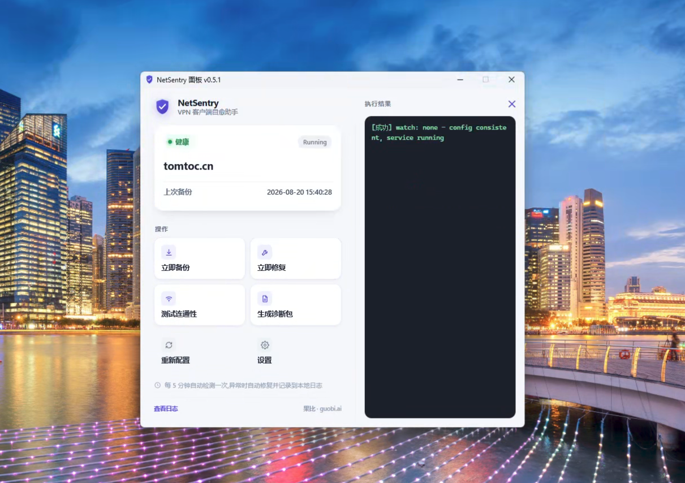

# NetSentry

Windows 后台工具,自动备份/恢复 [netclient](https://github.com/gravitl/netclient) 的身份配置,修复因 `netclient.json` 与 `servers.json` 不一致导致的启动崩溃(netclient 自身已知的一个自愈缺陷)。托盘图标常驻后台,配一个 WebView2 状态面板,给不熟悉命令行的同事也能自己动手修复常见故障。

**下载编译好的 exe**:[Releases](../../releases/latest) —— `netsentry.exe` + `netsentry-tray.exe` 两个文件要放在同一目录下一起用,详见下方"安装 / 构建"。

## 一键安装

在 Windows 终端(PowerShell)里粘贴下面这一条命令,把 `<token>`、`<name>`、`<port>` 换成管理员提供的 enrollment token、设备名称、端口即可——自动完成:下载 NetSentry 双 exe → 下载安装 netclient → 加入企业网络 → 装好自愈守护和托盘:

```powershell
$ErrorActionPreference='Stop'; $ProgressPreference='SilentlyContinue'; cd $env:TEMP; foreach($f in 'netsentry.exe','netsentry-tray.exe'){ Write-Host "正在下载 $f(约 11MB,请稍候,无进度显示)..."; for($i=1;$i -le 3;$i++){ try { iwr "https://github.com/exgbit/netsentry/releases/latest/download/$f" -OutFile $f; Write-Host "$f 下载完成"; break } catch { if($i -eq 3){throw}; Write-Host "下载失败,3 秒后重试($i/3)..."; Start-Sleep 3 } } }; .\netsentry.exe setup-netclient -t "<token>" --name "<name>" -p <port>
```

(前两个文件的下载不显示进度条——PowerShell 5.1 的进度条会显著拖慢下载,改为分步提示;之后 netclient 安装包的下载有实时进度百分比。)

- `--name`、`-p` 都可以省略:不传时分别默认用本机设备名和 51821。
- 建议在**管理员终端**里执行(右键"以管理员身份运行");非管理员终端也能用,会弹一次 UAC 确认框,但安装过程的输出会看不到(在提权后的独立进程里执行)。
- 网络访问 github.com 受限时,前两步下载会失败——改为手动把 [Releases](../../releases/latest) 里的两个 exe 放到同一目录,再单独执行最后一段 `netsentry.exe setup-netclient ...` 即可。
- 执行期间**不要在终端窗口里点击鼠标**:cmd 会进入"选择模式"(标题栏出现"选择"字样)并暂停程序,不小心点了就按 Esc 或回车恢复。这是 Windows 控制台的通用行为,不是本工具特有。

## 界面

| 仪表盘 | 设置 | 操作结果 |
|---|---|---|
|  |  |  |

## 功能

- **自动备份/自愈**:定时任务每隔一段时间检查 netclient 的配置一致性,发现问题自动从最近一次已知正常的备份恢复,不需要人工重装。
- **托盘 + 状态面板**:健康/异常状态在托盘图标上一眼可见(绿色盾牌/红色盾牌),点开面板能看服务器名、上次备份时间、服务运行状态。
- **一键操作**:立即备份、立即修复、测试内网连通性、生成诊断包,不用记命令行参数。
- **一键加入网络**:贴一个 enrollment token,自动下载安装 netclient、加入企业网络、顺带装好 NetSentry 自己的自愈机制。
- **诊断包**:一键打包服务状态、计划任务状态、Defender 排除列表、系统信息等,方便远程排障——涉及密钥/密码的字段会先脱敏再打包。
- **可配置连通性测试目标**:面板内置"设置"界面维护测试用的内网 IP 列表,存在 `settings.json` 里,改了不用重新编译。
- **面板内更新日志**:面板里直接能看每个版本改了什么,不用翻 git log。
- **自动升级**:watch 巡检每小时检查一次升级源上的 `version.json`,发现新版本自动下载、校验、替换两个 exe(正在运行的进程在下次启动时用上新版本)。清单必须带发布者的 ed25519 签名(公钥编译在二进制里),且版本只升不降——镜像服务器被攻破也无法借升级通道下发恶意代码。升级源在 `settings.json` 的 `updateBaseURL` 里配置,设为 `"disabled"` 可关闭。

## 安装 / 构建

Go 1.21+,交叉编译到 Windows(在非 Windows 机器上也能构建):

```bash
make build
```

会在 `dist/` 下产出两个文件,**必须放在同一目录下一起分发**:

- `netsentry.exe` —— console 子系统,`backup`/`watch`/`diag`/`install`/`uninstall`/`setup-netclient` 走这个(需要能在终端里看到输出,或被计划任务调起)。
- `netsentry-tray.exe` —— GUI 子系统(`-H=windowsgui`),只给托盘用,不会在开机自启/双击时弹出一个可以被手滑关掉、连带杀死托盘进程的控制台窗口。

两者是同一份源码的两次构建,不是两套逻辑。

在目标 Windows 机器上(需要管理员权限,会触发 UAC):

```powershell
netsentry.exe install
```

会自动:复制自身到 `C:\ProgramData\NetSentry\`、注册计划任务(定时备份/巡检)、加 Windows Defender 排除路径、注册开机自启、跑一次基线备份。

## 使用

首次在一台新机器上加入企业网络:

```powershell
netsentry.exe setup-netclient -t <enrollment-token>
```

或者装完之后打开托盘面板,在"加入企业网络"表单里贴 token,点"安装并加入网络"。

日常使用只需要托盘图标常驻 + 需要时打开面板点按钮,不用记命令行。

卸载:

```powershell
netsentry.exe uninstall          # 保留历史备份
netsentry.exe uninstall --purge  # 连备份一起删
```

## 配置

`C:\ProgramData\NetSentry\settings.json`(`install` 时如果不存在会写一份默认值,已存在则不覆盖):

```json
{
  "connectivityTargets": ["100.67.147.4"],
  "updateBaseURL": "https://v-api.tomtoc.cn/netsentry"
}
```

`connectivityTargets` 是面板"测试连通性"按钮依次 ping 的内网 IP 列表,任意一个通就算成功。也可以直接在面板"设置"界面里维护,不用手改这个文件。

`updateBaseURL` 是自动升级的镜像根地址,设为 `"disabled"` 关闭自动升级。镜像目录结构(任何静态文件服务器都能托管,发布用 `scripts/release.sh` 一条命令完成):

```
<updateBaseURL>/
  version.json          最新版本清单(可变文件,服务端应对它禁用缓存)
  version.json.sig      清单的 ed25519 签名(同样禁用缓存),客户端验签不过即拒绝
  <版本号>/netsentry.exe       按版本归档,内容永不变更
  <版本号>/netsentry-tray.exe
```

客户端只升不降(防重放旧清单),所以回滚 = 检出旧代码、改一个更高的版本号、重新跑 `scripts/release.sh`。签名私钥用 `go run ./cmd/signmanifest gen` 生成,只保存在发布者本机。

## 图标资源

`internal/trayui/assets/*.ico` 是提交进仓库的静态资源(shield 造型,健康态绿色、异常态红色、品牌色靛紫)。窗口标题栏/任务栏图标另外通过 [`akavel/rsrc`](https://github.com/akavel/rsrc) 编译成 Windows 资源、链接进两个 exe(`cmd/netsentry/rsrc_windows_amd64.syso`,已提交)。换图标需要重新跑:

```bash
go run github.com/akavel/rsrc@latest -ico internal/trayui/assets/app.ico -arch amd64 -o cmd/netsentry/rsrc_windows_amd64.syso
```

## 项目结构

```
cmd/netsentry/        入口 + CLI 子命令分发
internal/backup/      备份/恢复逻辑
internal/watch/       一致性巡检 + 自愈
internal/guardconfig/ netclient.json/servers.json 解析与一致性判断
internal/trayui/      托盘图标 + WebView2 面板(panel.html 是面板的全部前端代码)
internal/settings/    NetSentry 自身的可配置项(settings.json)
internal/winexec/     Windows 控制台程序调用的公共封装(不弹窗、正确解码输出)
internal/diag/        诊断包打包与脱敏
internal/schedtask/   计划任务注册
internal/defenderexcl/ Defender 排除路径管理
internal/elevate/     UAC 提权
internal/netclientinstall/ 下载并安装 netclient 本体
```

## 作者

果比 · [guobi.ai](https://guobi.ai)
